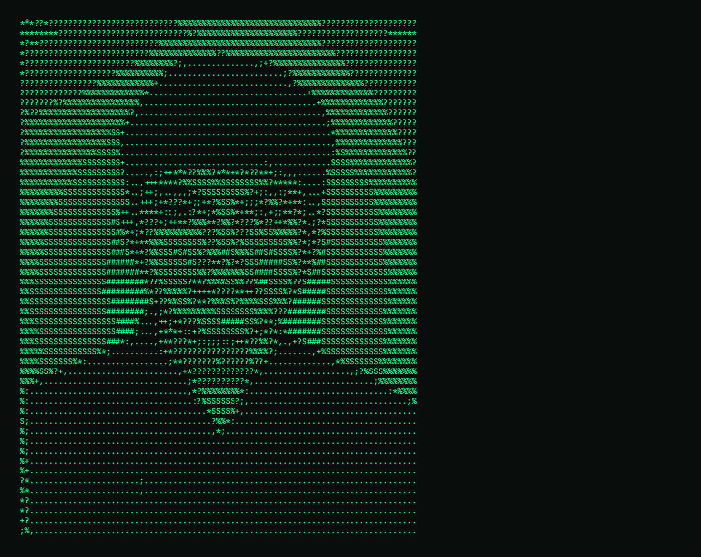

  
NIRBHAY SINGH CHAUHAN 
ROBOTICS & AI ENGINEERING · 3RD YEAR

> SYSTEM: NIRBHAY_SINGH_CHAUHAN 
> FIELD: ROBOTICS + ARTIFICIAL INTELLIGENCE 
> STATUS: BUILDING 
> MODE: EXPLORE → EXPERIMENT → UNDERSTAND → BUILD

  

<table> <tr> <td width="58%" valign="top">
PROFILE
  
I'm Nirbhay Singh Chauhan, a third-year Robotics and AI Engineering student with a strong curiosity for technology and problem-solving.
  
I enjoy working on things that genuinely interest me — especially when they challenge me to learn something new or build something meaningful.
  
I believe my best work comes from curiosity, experimentation, and the freedom to explore ideas that excite me.

</td> <td width="42%" valign="top">
CURRENT STATUS
  
FIELD 
Robotics & AI Engineering
  
YEAR 
Third Year
  
FOCUS 
Robotics · AI · Software
  
APPROACH 
Curiosity → Experiment → Learn → Build

</td> </tr> </table>

 
ENGINEERING STACK
  
PROGRAMMING 
<code>C</code> · <code>C++</code> · <code>C#</code> · <code>Java</code> · <code>Python</code> · <code>JavaScript</code>
  
ROBOTICS & AI 
<code>ROS</code> · <code>Raspberry Pi</code> · <code>PyTorch</code> · <code>TensorFlow</code> · <code>Keras</code> · <code>Scikit-learn</code>
  
SOFTWARE & DEVELOPMENT 
<code>HTML5</code> · <code>CSS3</code> · <code>React</code> · <code>Node.js</code> · <code>Docker</code> · <code>GitHub</code> · <code>Apache</code>
  
CLOUD & DATA 
<code>AWS</code> · <code>Azure</code> · <code>Oracle</code> · <code>Vercel</code> · <code>Render</code> · <code>MySQL</code> · <code>SQLite</code> · <code>Supabase</code> · <code>NumPy</code> · <code>Pandas</code> · <code>Matplotlib</code> · <code>Plotly</code>
  
TOOLS & CREATIVE 
<code>Blender</code> · <code>Adobe</code> · <code>Canva</code> · <code>Power BI</code> · <code>Unreal Engine</code>
  

<table> <tr> <td width="50%" valign="top">
LANGUAGE PROFILE
  

HTML 
🟥🟥🟥🟥🟥🟥🟥🟥🟥🟥
  
CSS 
🟥🟥🟥🟥🟥🟥🟥🟥🟥🟥
  
C++ 
🟥🟥🟥🟥🟥🟥🟥🟥🟥🟥
  
Python 
🟦🟦🟦🟦🟦🟦🟦⬜⬜⬜
  
Java 
🟩🟩🟩🟩🟩🟩🟩🟩⬜⬜
  
JavaScript 
🟦🟦🟦🟦🟦🟦🟦🟦⬜⬜
  
C 
⬜⬜⬜⬜⬜⬜⬜⬜⬜⬜
  
C# 
🟩🟩🟩🟩🟩🟩⬜⬜⬜⬜

</td> <td width="50%" valign="top">
HOW I WORK
  

I don't particularly enjoy working on something simply because it's expected.
  
I'm most productive when a problem is interesting enough to make me curious.
  
That curiosity usually turns into:

  
01 — EXPLORE 
Understand the idea and figure out what makes it interesting.
  
02 — EXPERIMENT 
Try things, test ideas and learn from what doesn't work.
  
03 — UNDERSTAND 
Go deeper into the parts that actually matter.
  
04 — BUILD 
Turn the interesting idea into something real.

</td> </tr> </table>

 
TECHNOLOGY MAP
  

<table>
<tr><th>AREA</th><th>TECHNOLOGIES</th></tr>
<tr><td><b>Programming</b></td><td>C · C# · C++ · Java · Python · JavaScript</td></tr>
<tr><td><b>Web</b></td><td>HTML · CSS · React · Node.js</td></tr>
<tr><td><b>Robotics</b></td><td>ROS · Raspberry Pi</td></tr>
<tr><td><b>AI / ML</b></td><td>PyTorch · TensorFlow · Keras · Scikit-learn</td></tr>
<tr><td><b>Data</b></td><td>NumPy · Pandas · Matplotlib · Plotly</td></tr>
<tr><td><b>Cloud</b></td><td>AWS · Azure · Oracle · Vercel · Render</td></tr>
<tr><td><b>Database</b></td><td>MySQL · SQLite · Supabase</td></tr>
<tr><td><b>Development</b></td><td>Docker · GitHub · Apache</td></tr>
<tr><td><b>Creative</b></td><td>Blender · Adobe · Canva · Power BI</td></tr>
<tr><td><b>Game / 3D</b></td><td>Unreal Engine · Epic Games · Steam · Ubisoft</td></tr>
</table>

  

┌────────────────────────────────────────────────────────┐ 
│ &nbsp;&nbsp;&nbsp;&nbsp;&nbsp;&nbsp;&nbsp;&nbsp;&nbsp;&nbsp;&nbsp;&nbsp;&nbsp;<strong>CURIOSITY IS THE INPUT</strong>&nbsp;&nbsp;&nbsp;&nbsp;&nbsp;&nbsp;&nbsp;&nbsp;&nbsp;&nbsp;&nbsp;&nbsp;&nbsp;│ 
│ &nbsp;&nbsp;&nbsp;&nbsp;&nbsp;&nbsp;&nbsp;&nbsp;&nbsp;&nbsp;<strong>EXPERIMENTATION IS THE PROCESS</strong>&nbsp;&nbsp;&nbsp;&nbsp;&nbsp;&nbsp;&nbsp;&nbsp;&nbsp;&nbsp;│ 
│ &nbsp;&nbsp;&nbsp;&nbsp;&nbsp;&nbsp;&nbsp;&nbsp;&nbsp;&nbsp;&nbsp;&nbsp;<strong>UNDERSTANDING IS THE OUTPUT</strong>&nbsp;&nbsp;&nbsp;&nbsp;&nbsp;&nbsp;&nbsp;&nbsp;&nbsp;&nbsp;&nbsp;&nbsp;│ 
│ &nbsp;&nbsp;&nbsp;&nbsp;&nbsp;&nbsp;&nbsp;&nbsp;&nbsp;&nbsp;&nbsp;&nbsp;&nbsp;&nbsp;&nbsp;&nbsp;&nbsp;&nbsp;&nbsp;&nbsp;&nbsp;&nbsp;&nbsp;&nbsp;&nbsp;&nbsp;&nbsp;&nbsp;&nbsp;&nbsp;&nbsp;&nbsp;&nbsp;&nbsp;&nbsp;&nbsp;&nbsp;&nbsp;&nbsp;&nbsp;&nbsp;&nbsp;&nbsp;&nbsp;&nbsp;&nbsp;&nbsp;&nbsp;&nbsp;&nbsp;&nbsp;&nbsp;&nbsp;&nbsp;│ 
│ &nbsp;&nbsp;&nbsp;&nbsp;&nbsp;&nbsp;&nbsp;&nbsp;&nbsp;&nbsp;&nbsp;&nbsp;<strong>BUILD WHAT INTERESTS YOU.</strong>&nbsp;&nbsp;&nbsp;&nbsp;&nbsp;&nbsp;&nbsp;&nbsp;&nbsp;&nbsp;&nbsp;&nbsp;&nbsp;│ 
└────────────────────────────────────────────────────────┘

  

<i>Curiosity is usually where the interesting projects begin.</i>

